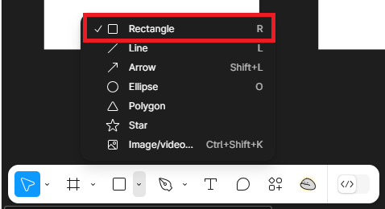
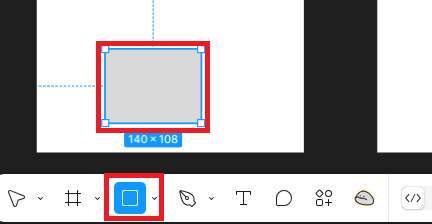
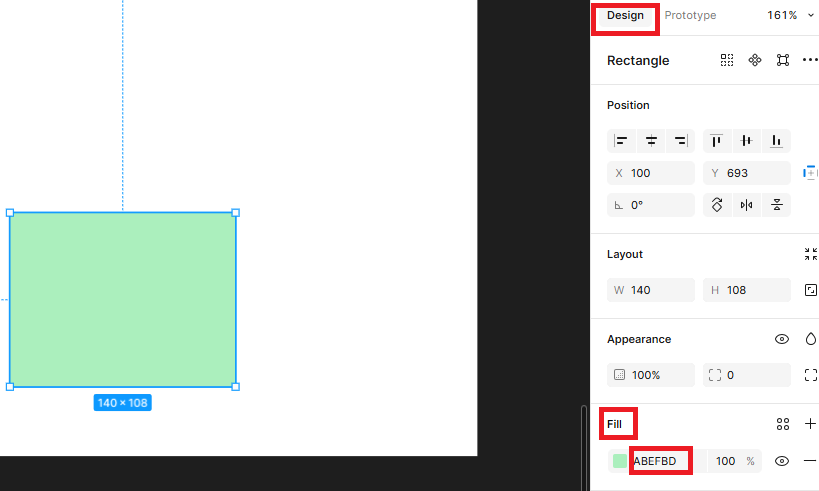
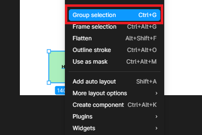
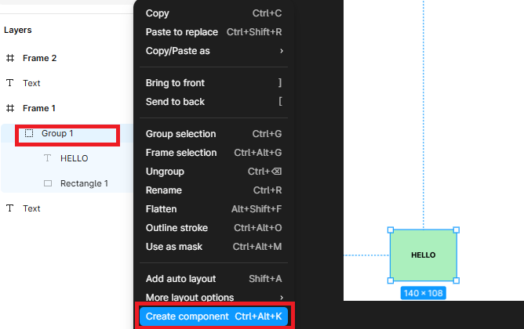
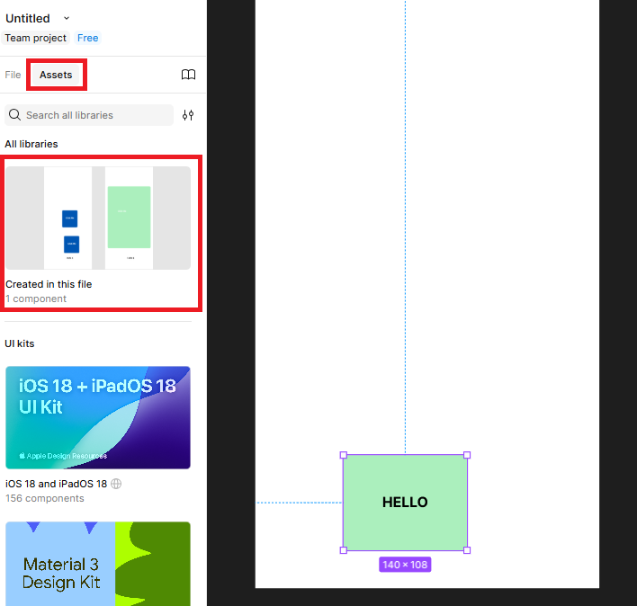
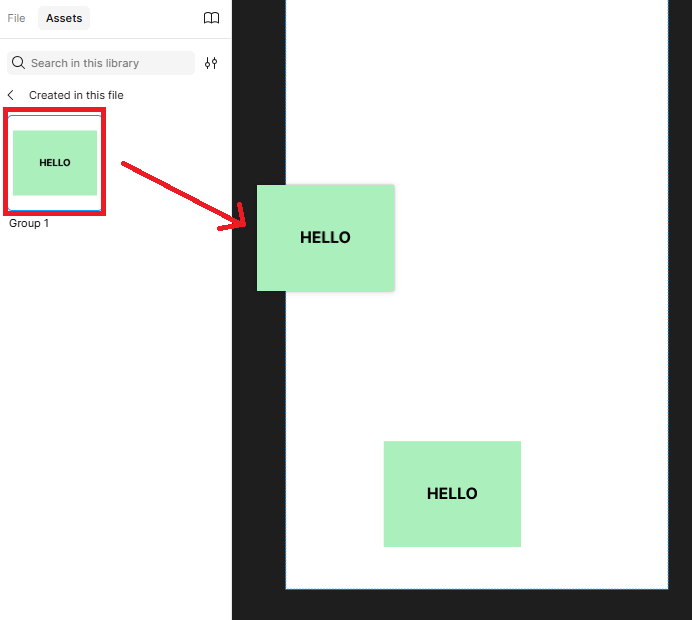

# Navigating the Toolbar and Creating Shapes

## Overview
This section will focus on the implementation of Figma's tools to design and manipulate elements. You will learn how to navigate the toolbar, create shapes, and apply styling to customize assets, ensuring you will create designs that stand out.

!!! warning "Setting up project"
    This section requires an already made workspace, which is introduced in section one. Please check out creating and setting up a Figma file before you start this section.
    

## Navigating the Toolbar
The toolbar is located at the bottom of the screen in the Figma workspace. It contains groups of useful tools for designing.

{.center_image}

1. The first group includes tools to manipulate the workspace

2. The second group contains tools for creating and customizing design elements.

## Manipulating the Workspace
We will learn how to use tools in Figma to manipulate your workspace catered towards your devices. 

!!! info "Keyboard Shortcuts"
    - Move Tool: `V`
    - Hand Tool: `H`
    - Zoom In/Out: `Ctrl + +/-` (Windows) or  `Cmd + +/-` (Mac)
    - Scale Tool: `Shift + S`

1. **Move Tool**:
    1. Select an item within your workspace
    {.center_image}
    2. Drag the selected item to reposition it somewhere else in your workspace.
    {.center_image}
    {.center_image}

2. **Hand Tool**:
    
    - {.center_image}
    1. Mouse: Use the Hand Tool to drag your camera view across the workspace. Hold down the middle mouse button to activate the tool.
    2. Touchpad: Tap and drag using two fingers to pan across the workspace.

3. **Zooming**:
    1. Mouse: Scroll the mouse wheel to zoom in or out.
    2. Touchpad: Pinch outwards to zoom in and pinch inwards to zoom out. 

4. **Scaling Items**:
    - {.center_image}
    1. Select the item to resize and activate the Scale tool. 
    {.center_image}
    2. Drag corners to adjust the size
    {.center_image}

!!! info "Shortcut for squares!"
    Hold `Shift` to maintain proportions during scaling

## Creating a Shape
1. Click the Rectangle Tool from the toolbar.
{.center_image}
2. Navigate to your workspace frame, click, then drag to draw a rectangle.
{.center_image}
3. Using the Scale tool, click and drag the corners of the rectangle to resize it
4. Hold `Shift` to maintain consist proportions (i.e. for squares)
5. Access the Properties Panel to change the fill colour to #ABEFBD.
{.center_image}
    
!!! info "Click the dropdown arrow beside the rectangle tool to access additional shape options (i.e. polygon, ellipse)"
    Follow similar steps above to customize these shapes.

## Creating Assets
To efficiently design and reuse components, you can create assets.

1. Start by creating a basic shapes, this will form the basis of your asset.
!!! info "Info"
    Follow Creating a Shape steps above for more customization.
2. Organize elements by grouping related items
3. Right-click and select "Group"
{.center_image}
!!! info "Group elements together shortcut"
    Select multiple elements and press `Ctrl + G` (Windows) or `Cmd + G` (Mac).
4. Right-click again and select `Create Component`
{.center_image}
5. Access your components from the `Assets ` panel, on the left hand of the screen.
{.center_image}
6. Drag and drop an drop into your design workspace. 
{.center_image}

## Conclusion
By the end of this section you will have successfully learned to:
- Navigate Figma Design's workspace.
- Create and style elements.
- Manipulate assets.

!!! success "Success"
    Great work! Now you can move on to the next section, Prototyping! You will learn all the tools to excel in prototyping design!

