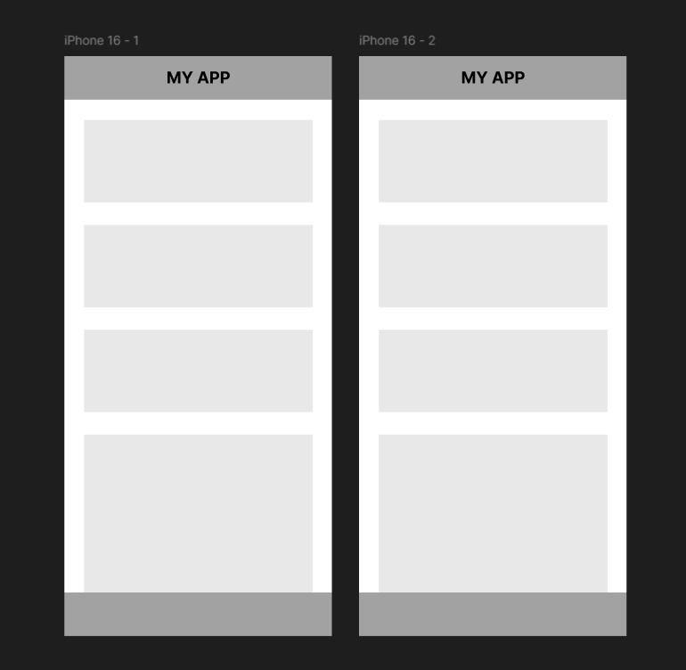

# Prototyping

## Overview
In this section, you will learn how to draw connections between frames to create interactive prototypes in Figma. 
This process allows you to simulate interactions, such as clicks or hovers, and design smooth transitions between screens.  

## Duplicating a Frame
1. Navigate to a frame in your workspace  
2. Right-click on the frame and select copy  
3. Paste the frame by pressing `Ctrl + V` (Windows) or `Cmd + V` (Mac)  

!!! success "Success"
    Here is what a duplicated frame should look like:  
    {.center_image}  

## Navigating to the Prototype Tab
1. Find the Prototype tab on the right-hand properties panel  
2. Click on it to switch to the prototyping view  

!!! info "Prototype Tab"  
    The Prototype tab allows interactions such as linking elements, defining triggers, and choosing transition effects between frames.  

## Creating the Connection
1. Go back to the first frame and click on an asset.  
2. Look for the small `+` icon located on the outer lines of the selected object.  
3. Click the `+` icon and drag the connection line to the duplicated frame.  

!!! info "Arrow Trigger"  
    An arrow will appear between the two frames after dragging the connection line, which represents the interaction.  

4. Click on the arrow between the two frames to select an interaction (e.g. "On Click", "On Hover").  

## Set Device Type and View Mode
1. Hover back to the prototype tab located in the right-hand screen.  
2. Scroll down to the prototype settings section.  
3. Select the device type under the device dropdown menu.  

!!! warning "Device Selection"  
    Select the appropriate device type that match your frame sizes for accurate testing.  

## Conclusion
By the end of this section, you will have successfully learned to:  
* [x] Duplicate frames to create multiple screens.  
* [x] Use the Prototype tab to set up connections between frames.  
* [x] Adjust settings for interactive elements.  
* [x] Select device type and view mode to accurately test prototypes.  

!!! success "Success"  
    Congrats! You have now learned to create an interactive prototype with clickable elements.  